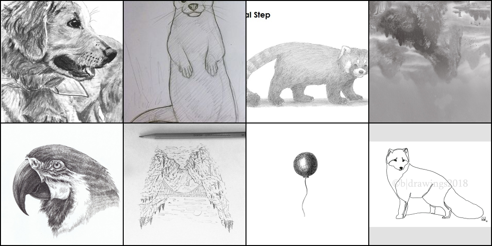
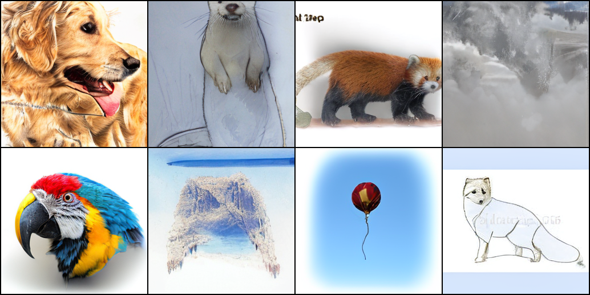
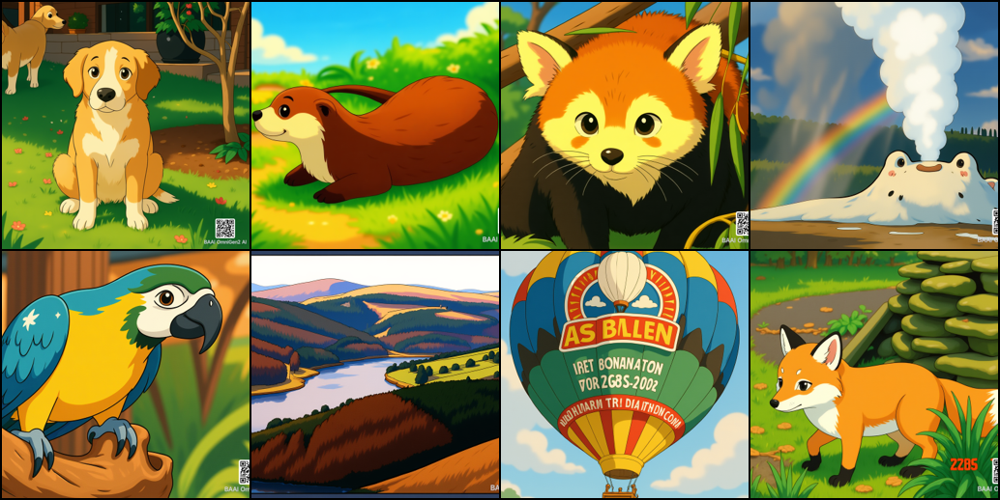
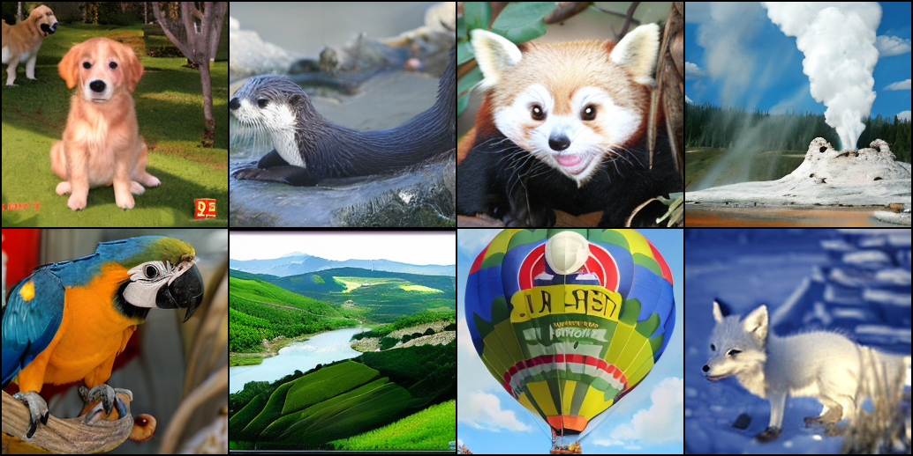
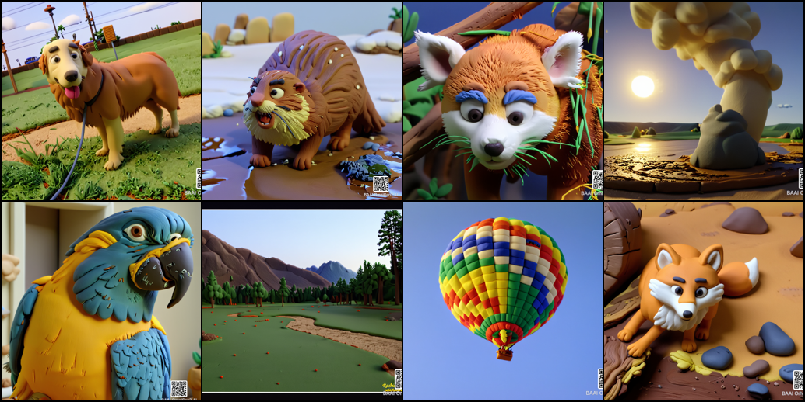
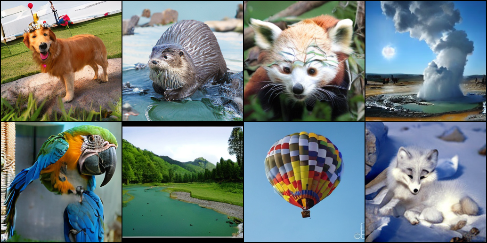
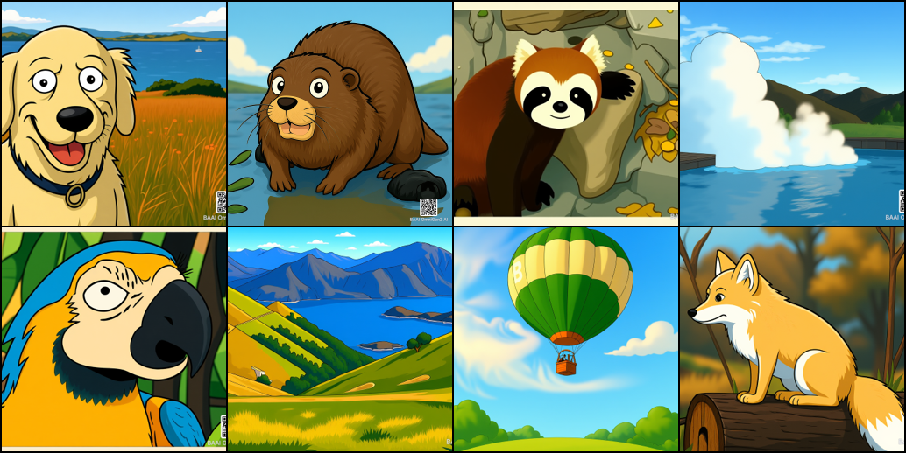
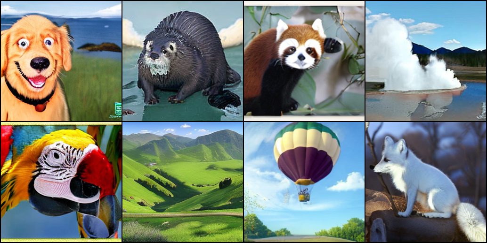

## BrainSee-DiT Official PyTorch Implementation

### [Paper]() | Run BrainSee  

We animate static images through translation and rotation transformations, apply equivariant constraints to the moving images, and perform multi-scale image reconstruction to learn multi-scale brain-like disentangled features. Then, we construct a multi-scale DiT and introduce the multi-scale brain-like features into DiT via cross-attention for training from scratch. During inference, it can spontaneously generate the effect of converting images of different styles into normal-style images. By setting brain-like features of reference images at different scales as control conditions, the fidelity of the original image can be flexibly controlled.

## Inference(Style Transfer)

### Sketch to natural image
prepare image to transfer
run bash style_sketch.sh
output image is under ./results/001-mask-0.94-60000-8-myDiT-XL-2/results/6930000/
Sketch image

Transfered image

### Ghibli-style to natural image
prepare image to transfer
run bash style_jibuli.sh
output image is under ./results/001-mask-0.94-60000-8-myDiT-XL-2/results/6930000/
Ghibli-style image

Transfered image

### Clay-style to natural image
Clay-style image

Transfered image

### Rick-and-Morty-style to natural image
Rick-and-Morty-style image

Transfered image

## License
The code and model weights are licensed under CC-BY-NC. See [`LICENSE.txt`](LICENSE.txt) for details.
